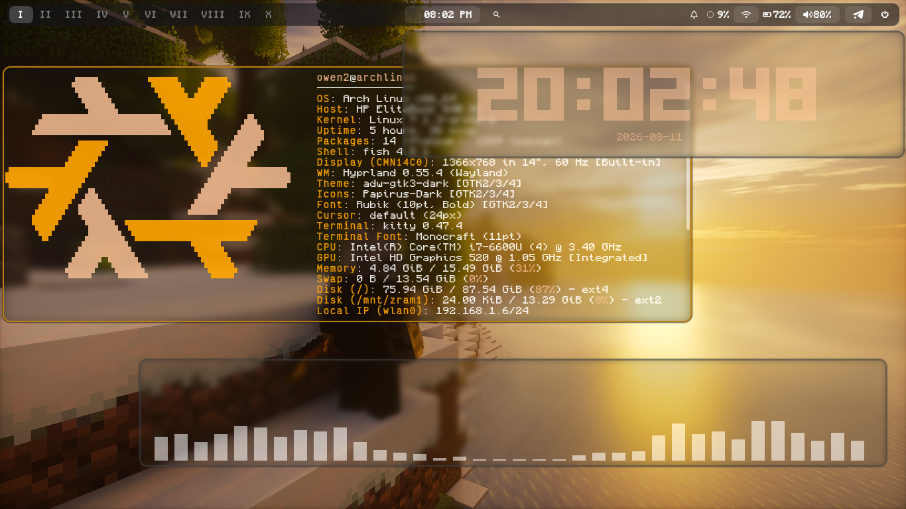
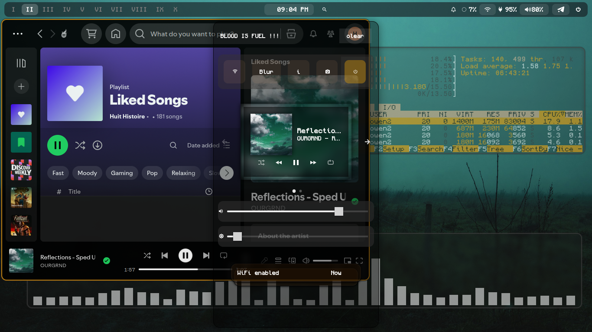
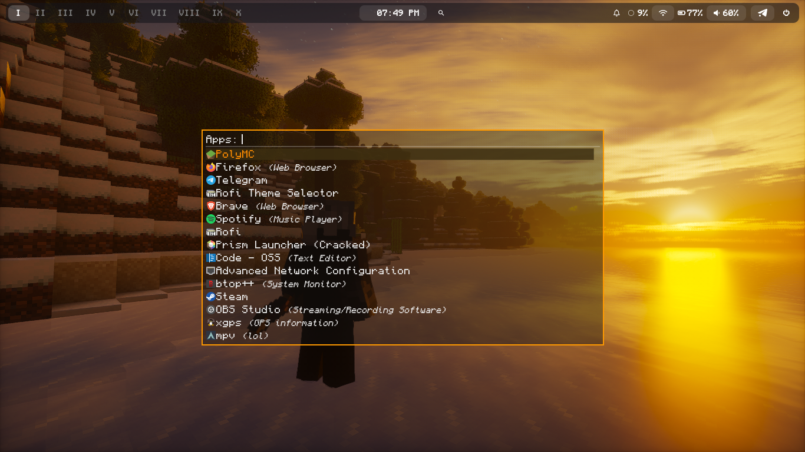
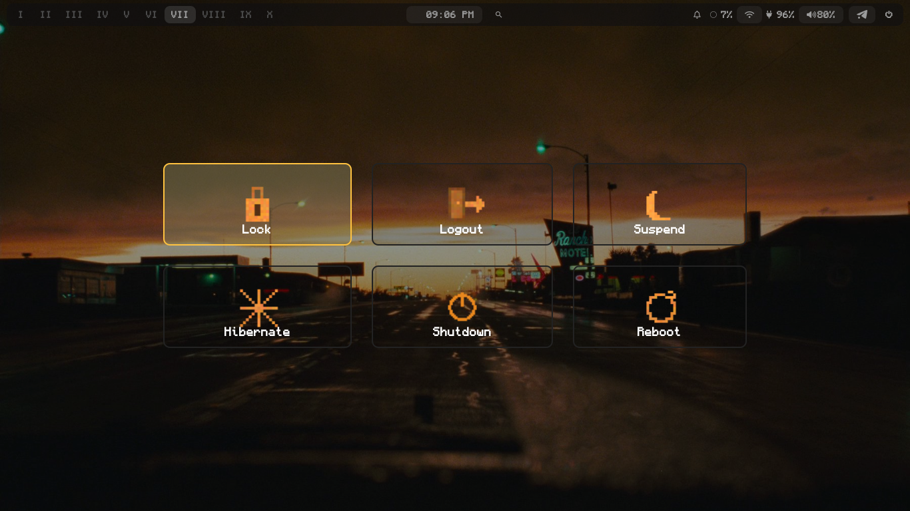
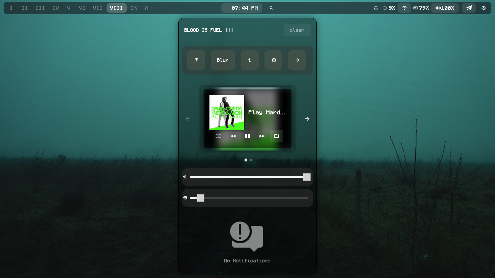

#    Hiiidotfiles
#  My Personal Hyprland Rice (From Scratch)

<div align="center">
  
  
  
  
</div>

---

##  Screenshots

<div align="center">
  
  
  
  
  
</div>

---

##  Tech Stack & Components

Here is the complete list of tools and packages I used to build this minimal and aesthetic environment from scratch:

| Component | Software Used | Description |
| :--- | :--- | :--- |
| **Window Manager** | [Hyprland](https://hyprland.org/) | Dynamic tiling Wayland compositor |
| **Status Bar** | [Waybar](https://github.com/Alexays/Waybar) | Highly customizable Wayland bar |
| **Notification Center** | [SwayNC](https://github.com/ErikReider/SwayNotificationCenter) | Wayland notification daemon |
| **Application Launcher** | [Rofi (Wayland)](https://github.com/lbonn/rofi) | App launcher & dmenu replacement |
| **Terminal Emulator** | [Kitty](https://sw.kovidgoyal.net/kitty/) | Fast, feature-rich, GPU-based terminal |
| **Shell** | [Fish](https://fishshell.com/) | User-friendly and interactive command line |
| **File Manager** | [Nemo](https://github.com/linuxmint/nemo) | Clean and fast desktop file manager |
| **Session Manager** | [Wlogout](https://github.com/ArtsyMacaw/wlogout) | Wayland logout menu |

---

##  Keybindings Quick Reference

Here are some of the essential keybindings configured in my `hyprland.conf`:

*   `SUPER` ➡️ Launch Application Menu (**Rofi**)
*   `SUPER` + `T` ➡️ Open Terminal (**Kitty**)
*   `SUPER` + `Q` ➡️ Kill Active Window
*   `SUPER` + `N` ➡️ Open SwayNC (**SwayNC**)
*   `SUPER` + `E` ➡️ Open File Manager (**Nemo**)
*   `SUPER` + `F` ➡️ Open browser (**firefox**)
*   `SUPER` + `SHIFT` + `M` ➡️ Exit Hyprland

*   `SUPER` + `L` ➡️ Chose a live wallpaper (**mpvpaper**)
*   `SUPER` + `O` ➡️ Kill the live wallpaper
*   `SUPER` + `W` ➡️ Chose a normal wallpaper (**awww**)

*   `SUPER` + `p` or `V` ➡️ Control the windows size (try it to see what I mean )
---

##  Installation & Deployment

To replicate this environment on a fresh Arch Linux system, clone this repository into your home directory and link the configuration files:

```bash
# 1. download this first

sudo pacman -Syu
sudo pacman -S hyprland hyprlock hypridle hyprpaper waybar swaync rofi-wayland kitty fish nemo wlogout mpvpaper zsh

# 2. Clone the repository :

git clone [https://github.com/aboutsay/Hiiidotfiles.git](https://github.com/aboutsay/Hiiidotfiles.git) ~/Hiii_dotfiles


# 3. start installation :

cd Hiii_dotfiles
chmod +x ~/Hiii_dotfiles/Scripts/install_S.sh
./Scripts/install_S.sh


#...
