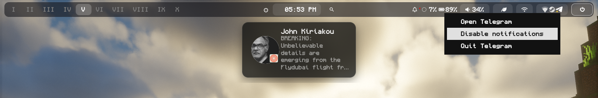
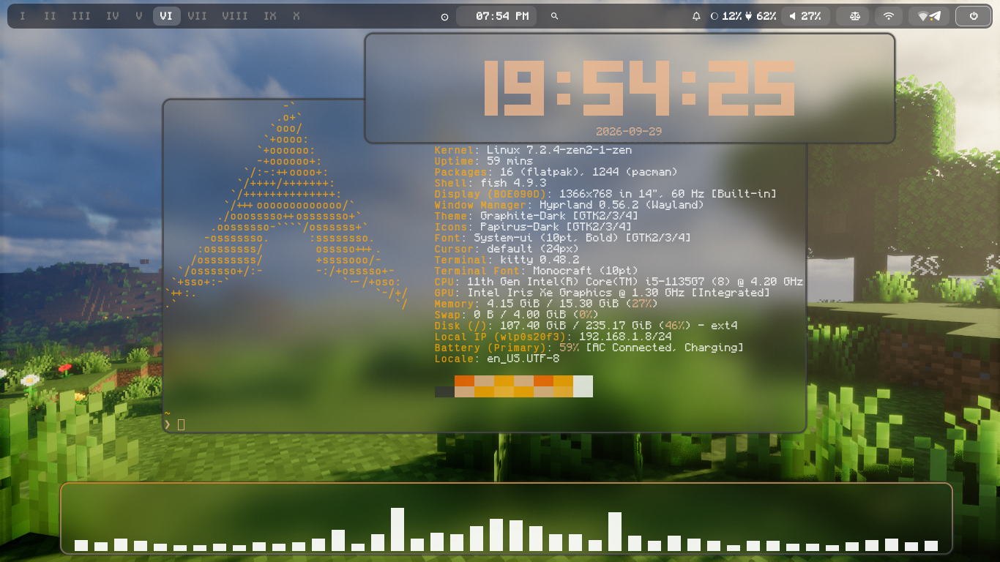
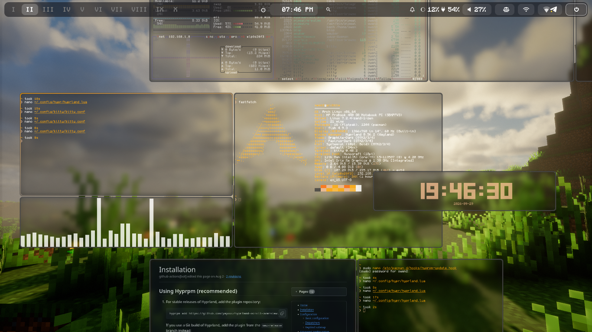
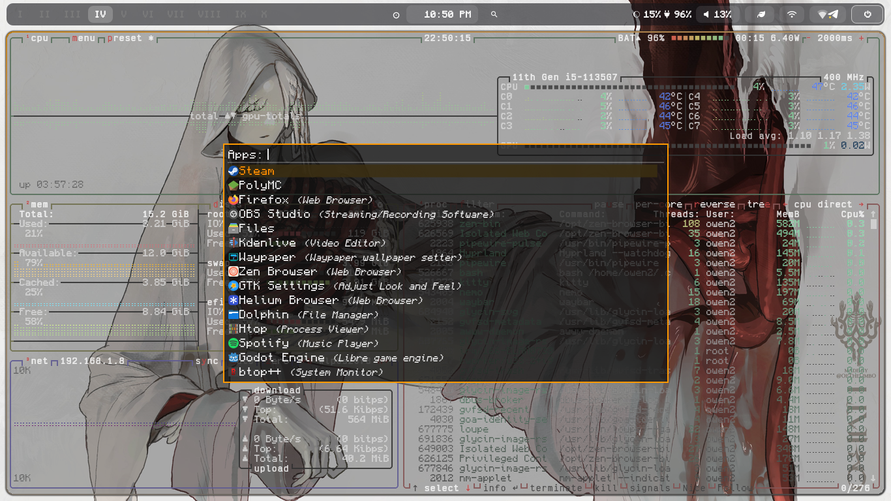
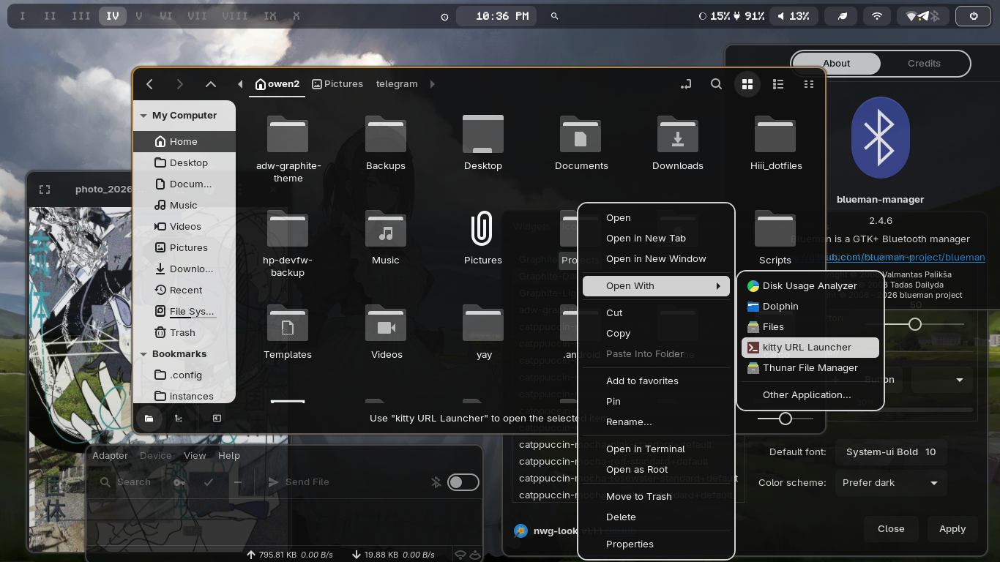
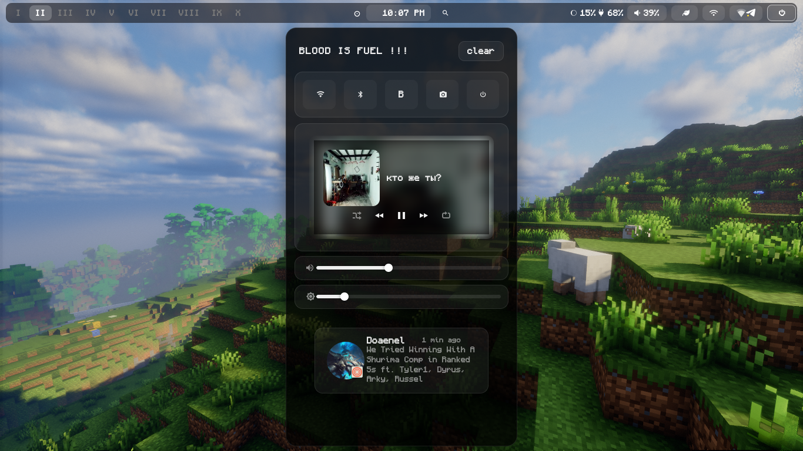
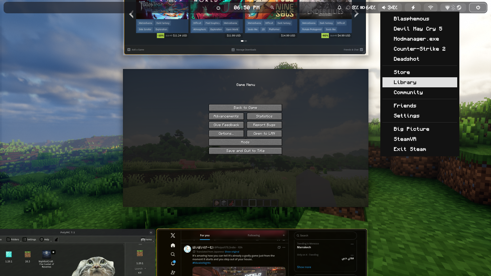

# Hiiidotfiles
##  A simple Hyprland x Niri Dotfiles (From Scratch + No quick shell)

<div align="center">
  
  
  
</div>

---

##  Screenshots

## waybar

<div align="center">
  
</div>

## extended look

<div align="center">
  
  
  
  
  
</div>

---
## New Niri config Besides of Hyprland 

now you can try both hyprland and niri on the same user , using the same tools config . just make sure that you have GDM or any log in menu that u can change between the WMs you want :

<div align="center">
  
</div>


---

##  Keybindings Quick Reference

Here are some of the essential keybindings configured in my `hyprland.lua` or niri cofig file:

*   `SUPER` ➡️ Launch Application Menu (**Rofi**) (`SUPER` + `z` for Niri) 
*   `SUPER` + `escape` ➡️ Open Tthe overview (**overview**)
*   `SUPER` + `T` ➡️ Open Terminal (**Kitty**)
*   `SUPER` + `Q` ➡️ Kill Active Window
*   `SUPER` + `N` ➡️ Open SwayNC (**SwayNC**)
*   `SUPER` + `E` ➡️ Open File Manager (**Nemo**)
*   `SUPER` + `F` ➡️ Open browser (**zen-browser-bin**)

*   `SUPER` + `L` ➡️ Chose a live wallpaper (**mpvpaper**)
*   `SUPER` + `O` ➡️ Kill the live wallpaper
*   `SUPER` + `W` ➡️ Random normal wallpaper (**awww**)

*   `SUPER` + `p` or `V` ➡️ Control the windows size (try it to see what I mean )
---

##  Installation & Deployment

To replicate this environment on a fresh Arch Linux system, clone this repository into your home directory and link the configuration files:

```bash
# 1. download this first

sudo pacman -Syu
sudo pacman -S hyprland kitty

#it prefered to download Gnome in case something happen
# 2. Clone the repository :

git clone https://github.com/aboutsay/Hiiidotfiles.git ~/Hiii_dotfiles


# 3. start installation :

cd Hiii_dotfiles
chmod +x ~/Hiii_dotfiles/Scripts/install_S.sh
./Scripts/install_S.sh


#...
